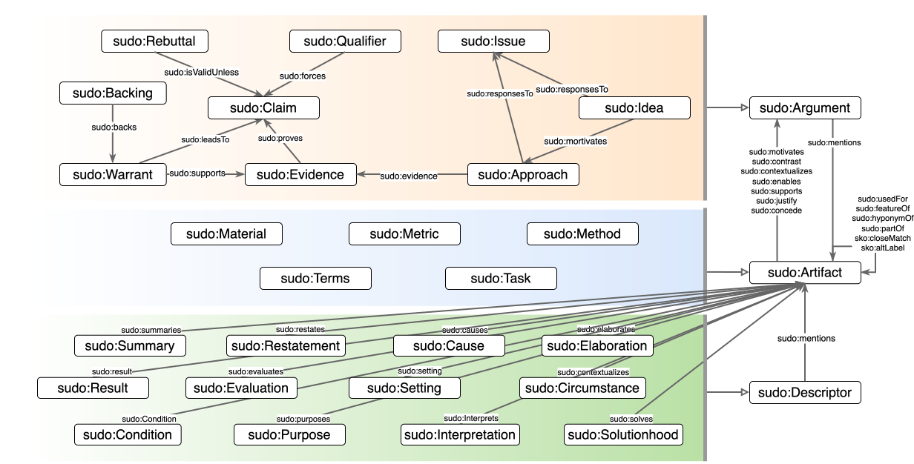

# SUDO Ontology
## Ontology Documentation

- **Latest version documentation (Widoco)**  
  ./ontology/ontology.rdf

- **Ontology IRI**  
  https://w3id.org/anonymous/sudo/ontology

- **Version IRI**  
  https://w3id.org/anonymous/sudo/ontology/releases/3.3.0

- **Abstract**  
  The SUDO Ontology represents ideas, issues, arguments, and approaches in scientific research and scholarly communication.

- **Creator**  
  Anonymous  

- **Publisher**  
  Anonymous

- **License**  
  https://opensource.org/licenses/MIT

- **Preferred namespace**  
  https://w3id.org/anonymous/sudo/ontology#

- **Version 2.2.0**  
  https://w3id.org/anonymous/sudo/ontology/releases/2.2.0

- **Version 2.0.0**  
  https://w3id.org/anonymous/sudo/ontology/releases/2.0.0

- **Version 1.0.0**  
  https://w3id.org/anonymous/sudo/ontology/releases/1.0.0

- **Ontology RDF (RDF/XML)**  
  ./ontology/idea.rdf
