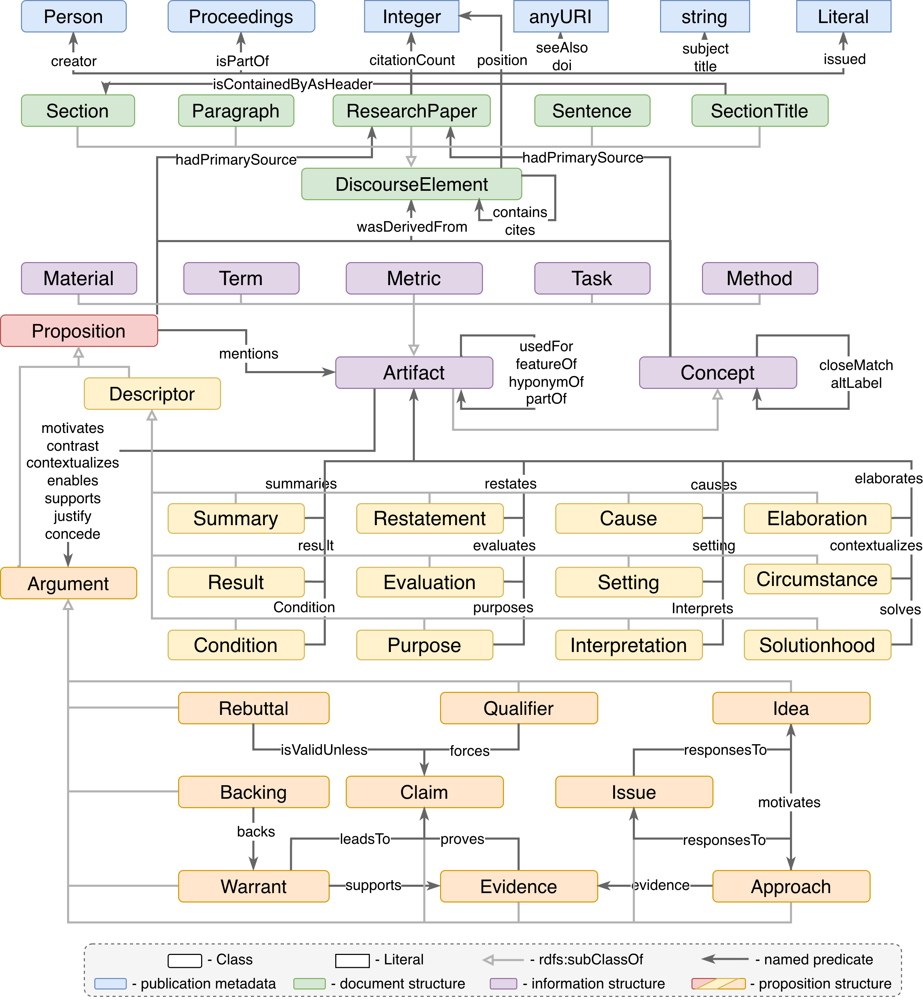

# SUDO Ontology
## Ontology Documentation

- **Latest version documentation (Widoco)**  
  [https://tetherless-world.github.io/idea-ontology/ontology/releases/3.5.0/docs/index-en.html](https://tetherless-world.github.io/sudo-ontology/)

- **Ontology IRI**  
  https://w3id.org/twc/sudo/ontology

- **Version IRI**  
  https://w3id.org/twc/sudo/ontology/releases/3.5.0

- **Abstract**  
  The SUDO Ontology represents ideas, issues, arguments, and approaches in scientific research and scholarly communication.

- **Creator**  
  Nipun D. Pathirage
  Oliveira Santos, Henrique
  McGuinness, Deborah 

- **Publisher**  
  Tetherless World Constellation | Rensselaer Polytechnic Institute

- **License**  
  https://opensource.org/licenses/MIT

- **Preferred namespace**  
  https://w3id.org/twc/sudo/ontology#

- **Version 3.4.0**  
  https://tetherless-world.github.io/idea-ontology/ontology/releases/3.4.0

- **Version 3.3.0**  
  https://tetherless-world.github.io/idea-ontology/ontology/releases/3.3.0

- **Version 3.2.0**  
  https://tetherless-world.github.io/idea-ontology/ontology/releases/3.2.0

- **Ontology RDF (RDF/XML)**  
  https://tetherless-world.github.io/idea-ontology/ontology/idea.rdf
